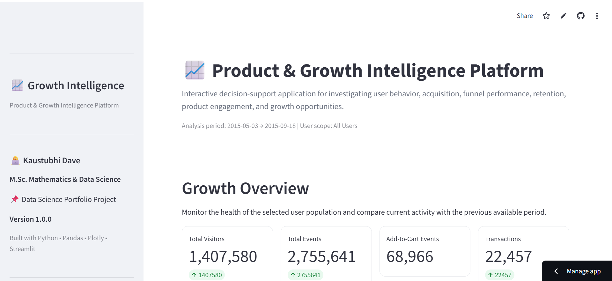
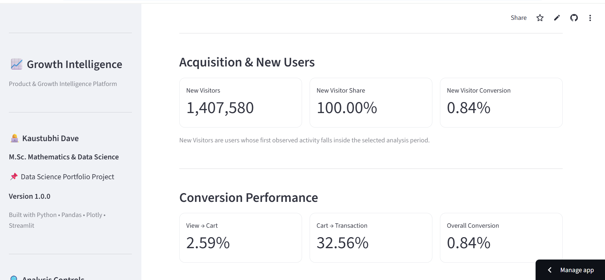
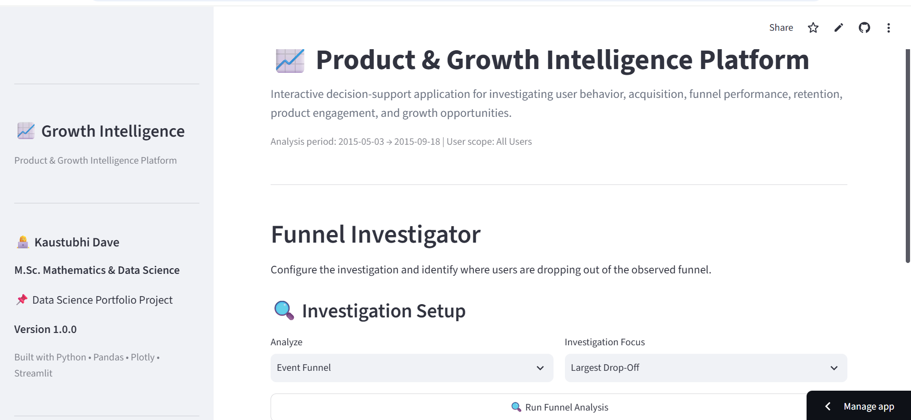
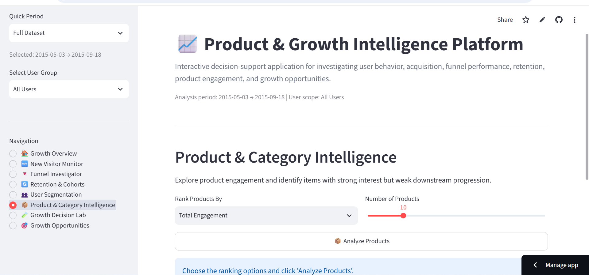
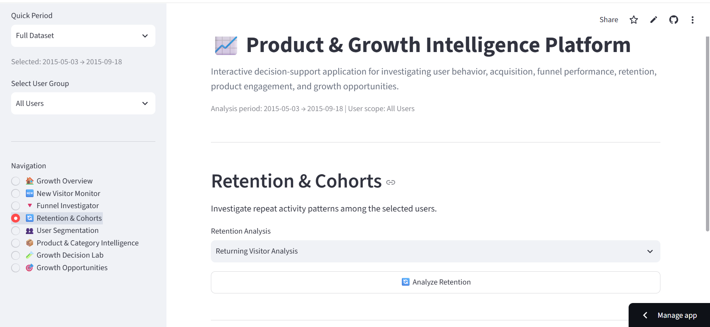
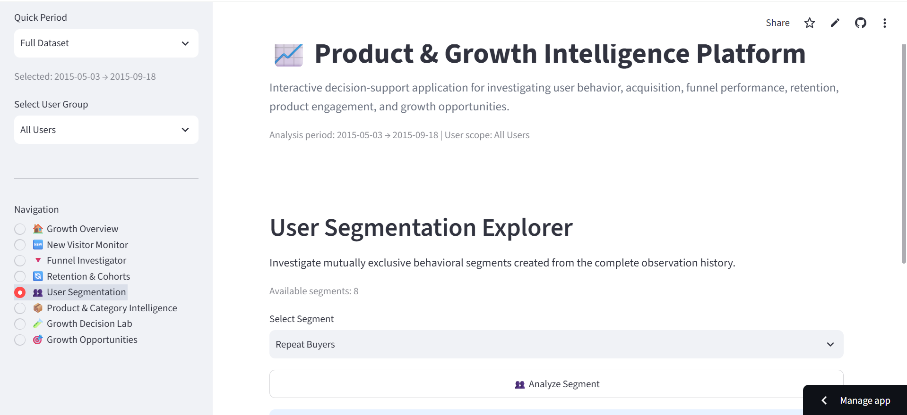
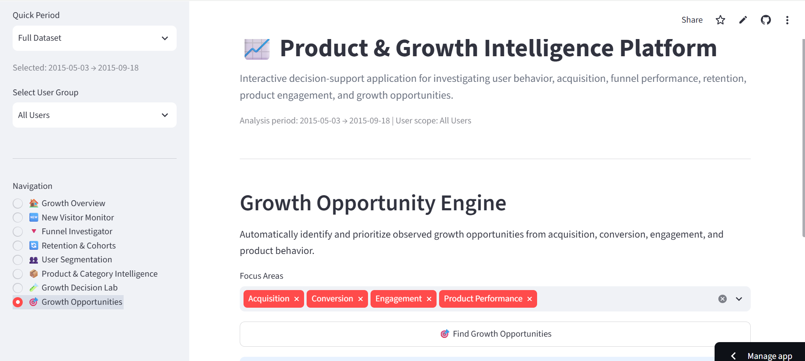

# 📈 Product & Growth Intelligence Platform

An interactive data analytics and decision-support application designed to investigate user behavior, acquisition, funnel performance, product engagement, retention, segmentation, and growth opportunities.

Built as a Data Science portfolio project using Python, Pandas, Plotly, and Streamlit.

---

## 🚀 Live Application

🔗 **Live Streamlit App:** [Open the Product & Growth Intelligence Platform](https://kaustubhi-growth-intelligence.streamlit.app/)
---

## 📌 Project Overview

Understanding user behavior is essential for product growth. Raw event-level data can contain millions of interactions, making it difficult to identify meaningful business insights.

The **Product & Growth Intelligence Platform** transforms user and event data into an interactive analytics application that helps investigate:

- User acquisition
- Visitor activity
- Conversion funnels
- Product engagement
- User retention
- User segmentation
- Growth opportunities

The application provides an interactive environment where users can filter data and explore important product and growth metrics.

---

## 🎯 Business Problem

Product and growth teams need answers to important questions such as:

- How many users are visiting the platform?
- How many events are being generated?
- Where are users dropping off in the conversion funnel?
- Which acquisition sources are performing best?
- How are users engaging with products?
- Are users returning over time?
- Which user segments are most valuable?
- Where are the biggest growth opportunities?

This project addresses these questions through an interactive analytics and decision-support application.

---

## ✨ Key Features

### 1. 📊 Growth Overview

Provides a high-level view of platform performance through important KPIs and trends.

Key metrics include:

- Total Visitors
- Total Events
- Add-to-Cart Events
- Transactions
- User Activity Trends

---

### 2. 📥 Acquisition Analysis

Analyzes how users arrive on the platform and evaluates acquisition performance.

Insights include:

- User acquisition channels
- Source performance
- Visitor distribution
- Acquisition trends
- High-performing channels

---

### 3. 🔻 Funnel Analysis

Analyzes the user journey through important stages of the product funnel.

The analysis helps identify:

- Funnel progression
- Conversion performance
- Drop-off points
- Transaction completion
- Potential friction in the user journey

---

### 4. 🛍️ Product Engagement

Investigates how users interact with products and product-related events.

Insights include:

- Product interactions
- Add-to-cart behavior
- Engagement patterns
- Product activity
- User interaction trends

---

### 5. 🔄 Retention Analysis

Analyzes returning user behavior and activity over time.

The retention analysis helps understand:

- Returning users
- Repeat activity
- User retention patterns
- Long-term engagement
- Changes in user activity

---

### 6. 👥 User Segmentation

Groups users based on behavioral characteristics.

Segmentation can help identify:

- High-value users
- Highly engaged users
- Low-engagement users
- Different behavioral patterns
- Potential target groups

---

### 7. 💡 Growth Opportunities

Highlights potential areas where product and growth improvements can be made.

Examples include:

- Improving funnel conversion
- Reducing user drop-off
- Increasing product engagement
- Improving retention
- Focusing on high-performing user segments

---

## 🖥️ Application Screenshots

### 📊 Growth Overview



---

### 📥 Acquisition Analysis



---

### 🔻 Funnel Analysis



---

### 🛍️ Product Engagement



---

### 🔄 Retention Analysis



---

### 👥 User Segmentation



---

### 💡 Growth Opportunities



---

## 🛠️ Technology Stack

| Technology | Purpose |
|---|---|
| Python | Core application development |
| Pandas | Data processing and analysis |
| NumPy | Numerical operations |
| Plotly | Interactive visualizations |
| Streamlit | Interactive web application |

---

## 📂 Project Structure

```text
03_Product_Growth_Intelligence/
│
├── app/
│   └── app.py
│
├── data/
│   ├── raw/
│   └── processed/
│
├── assets/
│   └── screenshots/
│       ├── 01_growth_overview.png
│       ├── 02_acquisition_analysis.png
│       ├── 03_funnel_analysis.png
│       ├── 04_product_engagement.png
│       ├── 05_retention_analysis.png
│       ├── 06_user_segmentation.png
│       └── 07_growth_opportunities.png
│
├── requirements.txt
├── README.md
├── .gitignore
└── .gitattributes